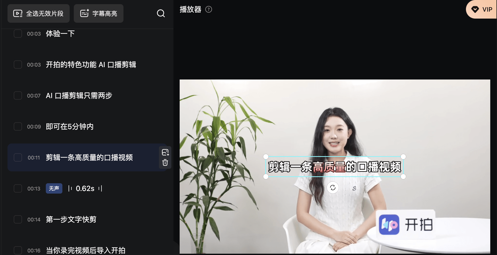
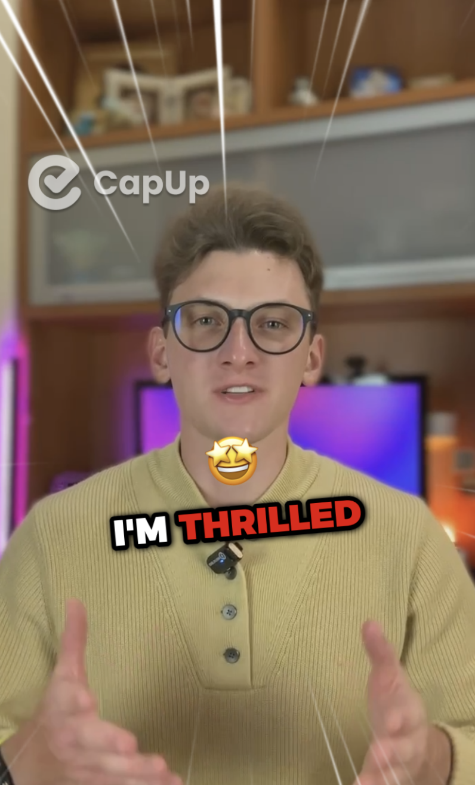
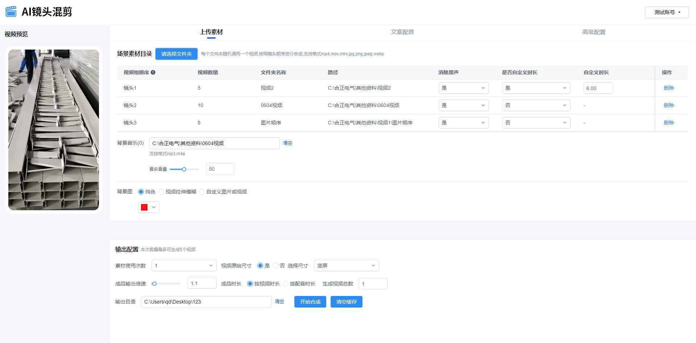

# WebAV-Pro

中文 | [English](./README_EN.md)

_建设中_

**WebAV-Pro 将是一个商业版 SDK**，早期价格可以商量，基础版开源免费项目请访问 [WebAV](https://github.com/WebAV-Tech/WebAV)。

WebAV 不依赖服务器，可以在纯 Web 平台（浏览器、Electron 等）上创建/编辑音视频文件，它提供了视频编辑的基础能力。

WebAV-Pro 继承了 WebAV 的所有特性（跨平台、零成本、高性能...），计划提供视频编辑相关的

1. 进阶能力：转场、动画、滤镜...
2. 常用功能：时间/轨道轴、口播剪辑、高级字幕、花字特效、视频模板、脚本批量处理...

WebAV-Pro 最重要的特点是可组合、可定制化，用户可以基于这些功能或模块，快速组合出定制化的解决方案。

WebAV-Pro 目前正在建设中，会优先满足 **AI 视频领域**的需求。

如果你对 Web 视频处理有好的想法、**购买授权或定制开发**，欢迎联系我，我的联系方式：

- 邮箱：`hughfenghen@gmail.com`
- 微信： `liujun_fenghen`，**切记备注**： `WebAV-Pro`
- 博客： <https://fenghen.me>

你也可以在本项目的 Issues 中提出你的想法。

## 计划做的功能

WebAV-Pro 以 SDK 形式提供可组合、可定制的功能，可接受定制开发，以下是规划中的功能。

### WebAV Pro Plan

- [x] 普通转场
- [ ] 高级转场 WebGL
- [x] 普通滤镜
- [ ] 高级滤镜 WebGL
- [x] 视频裁剪
- [x] AI 数字人绿幕抠图
- [x] WebVTT 字幕
- [x] 花字
- [x] 标题文字动效、高级字幕动效
- [ ] 运镜
- [ ] 特效（流星雨、射线、星星、雪花等）

作者本人正在基于 Pro SDK 开发一款 AI 视频编辑软件，完成原型后分享，若有兴趣可以[关注我](https://fenghen.me/subscribe.html)。

以下是优秀产品中的功能截图，这些产品已经集成了 WebAV SDK。

### 口播文字剪辑视频

### 自动高亮/动画重点文案

### 创意动画导出为视频

https://github.com/user-attachments/assets/7f98c379-b773-484f-8537-714171a6d6c5

### 素材混剪，批量生成视频

---
