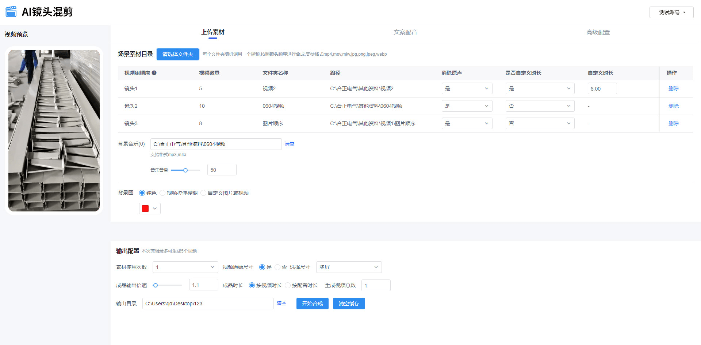

# WebAV-Pro

[中文](./README.md) | English

_Work In Progress_

**WebAV-Pro will be a commercial SDK**. Early pricing is negotiable. For the free open-source basic version, please visit [WebAV](https://github.com/WebAV-Tech/WebAV).

WebAV does not rely on a server. It allows you to create/edit audio and video files purely on web platforms (browsers, Electron, etc.), providing basic video editing capabilities.

WebAV-Pro inherits all the features of WebAV (cross-platform, zero cost, high performance...) and plans to provide video editing-related:

1. Advanced features: transitions, animations, filters...
2. Common functions: timeline/track, talking-head editing, advanced subtitles, animated text effects, video templates, batch script processing...

The most important feature of WebAV-Pro is its composability and customizability. Users can quickly assemble customized solutions based on these features or modules.

WebAV-Pro is currently under development and will prioritize the needs of the **AI video field**.

If you have good ideas for web-based video processing, **want to purchase a license or request custom development**, feel free to contact me. My contact information:

- Email: `hughfenghen@gmail.com`
- WeChat: `liujun_fenghen` (please note: `WebAV-Pro`)
- Blog: <https://fenghen.me>

You can also submit your ideas in the Issues section of this project.

## Planned Features

WebAV-Pro provides composable and customizable features as an SDK and currently does not plan to make consumer-facing (to C) products, but custom development is available.

Below are screenshots of features from excellent products that have already integrated the WebAV SDK.

### Talking-Head Text Video Editing

### Auto Highlight/Animated Key Copy

### Export Creative Animations as Video

https://github.com/user-attachments/assets/7f98c379-b773-484f-8537-714171a6d6c5

### Material Remix, Batch Video Generation

---
